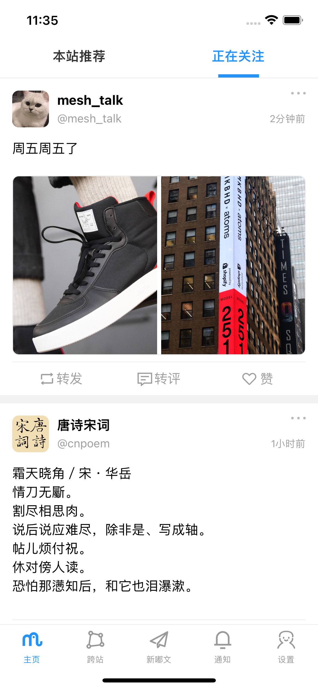
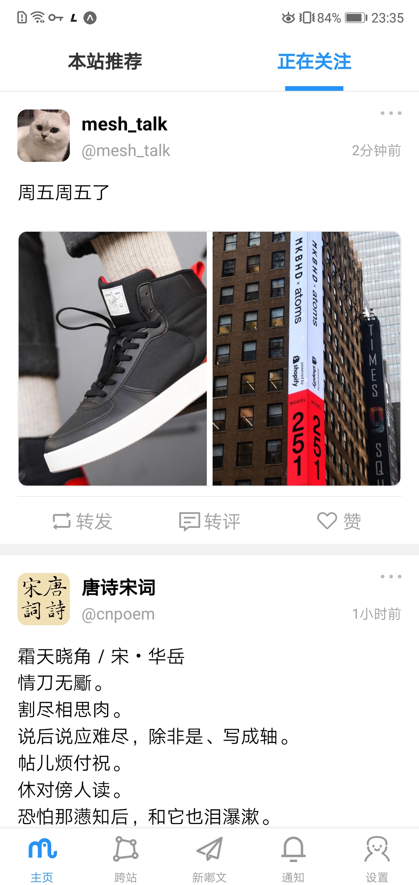
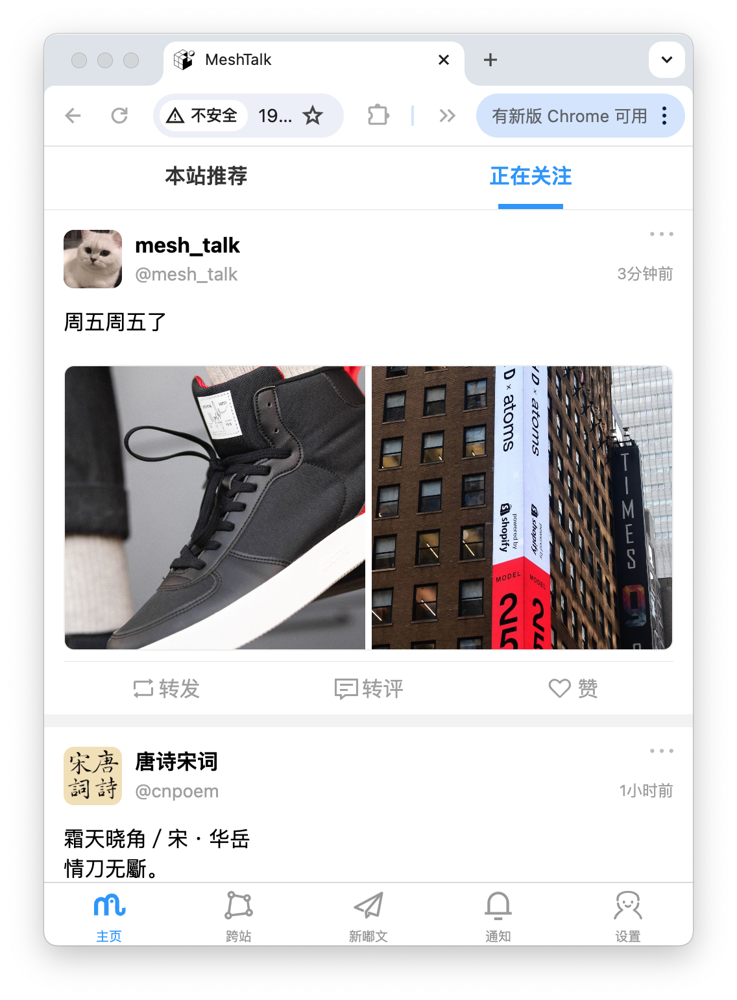
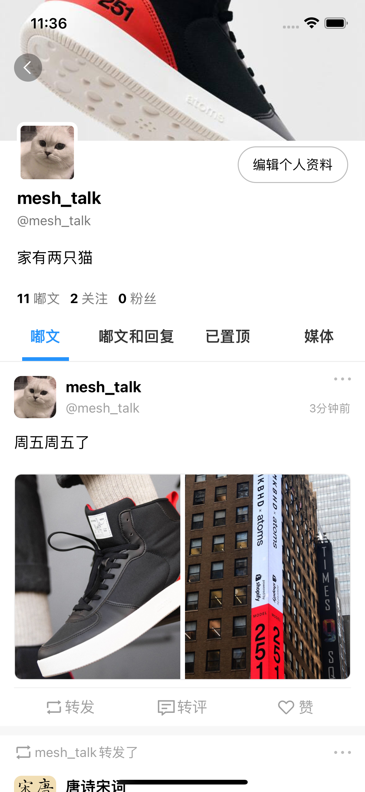
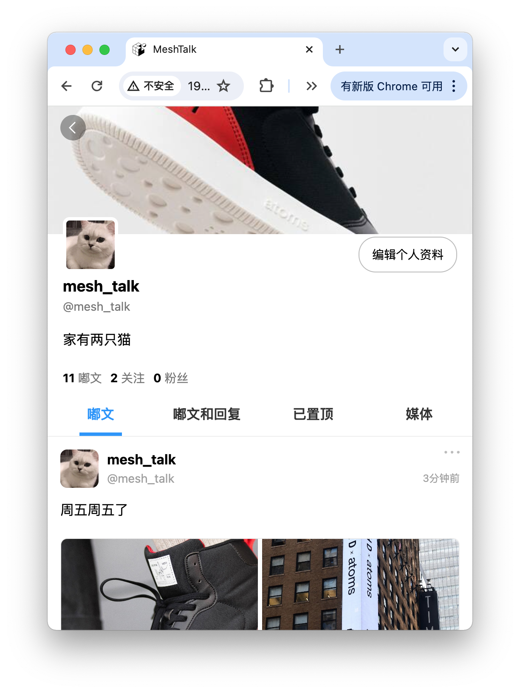
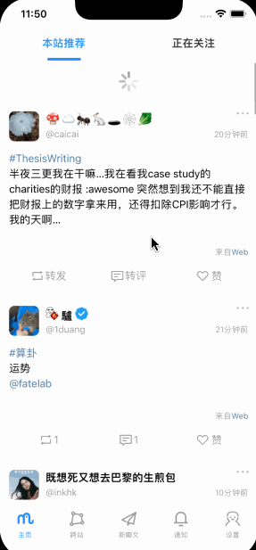

# MeshTalk
MeshTalk is a third-party client for Mastodon, developed using react-native and typescript. It supports iOS, Android, and web. The project is built using Expo and ExpoGo as a development tool.
# ScreenShot
## You can check out the screenshots below to see how it looks on various platforms.

| iOS | Android |web  |
| ----  | ----     | ----     |
|   |   |      | 
|   |   |      | 

## Here are some examples within the project.
|  |  |  |
| ----  | ----     | ----     |
|   |   |      | 

# TechStack
| Library  | Description     |
| -------- |  -------- |
| React Native     |  Mobile Framework    |
| TypeScript     |  Language    |
| Expo Router     |  Navigation    |
| Zustand     |  State Management    |
| RN Reanimated     |  Animations    |
| RN Gesture Handler     |  Gesture    |
| Flash List     |  list    |
